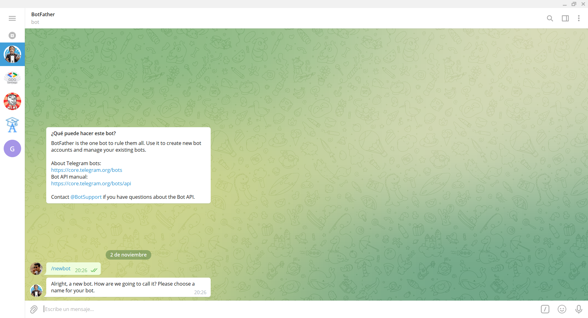
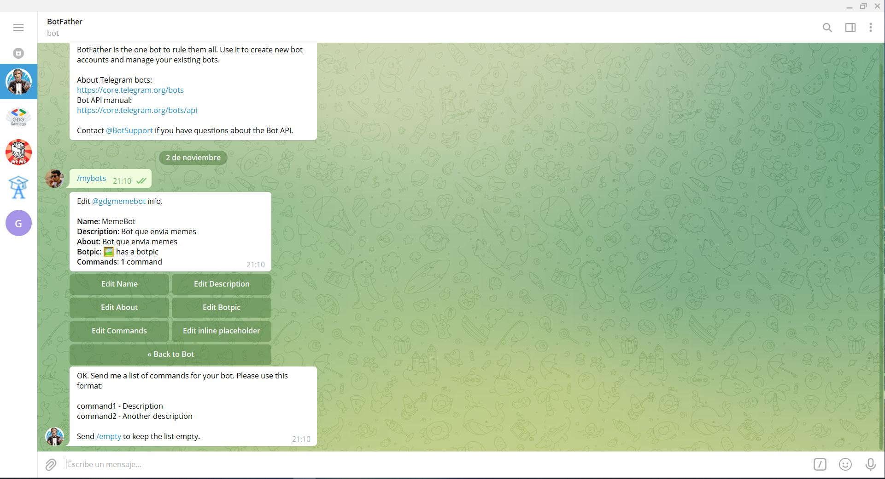
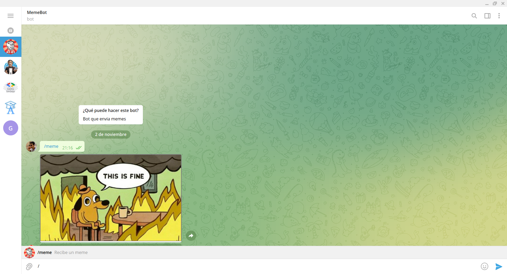
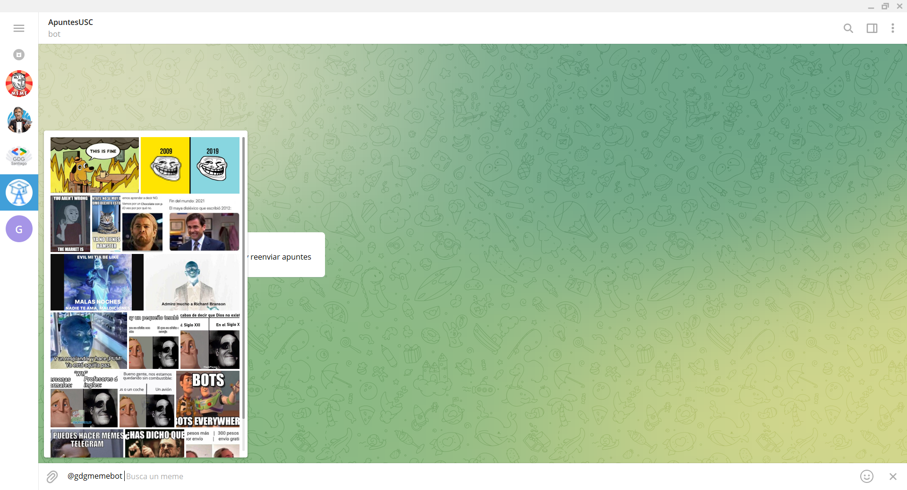
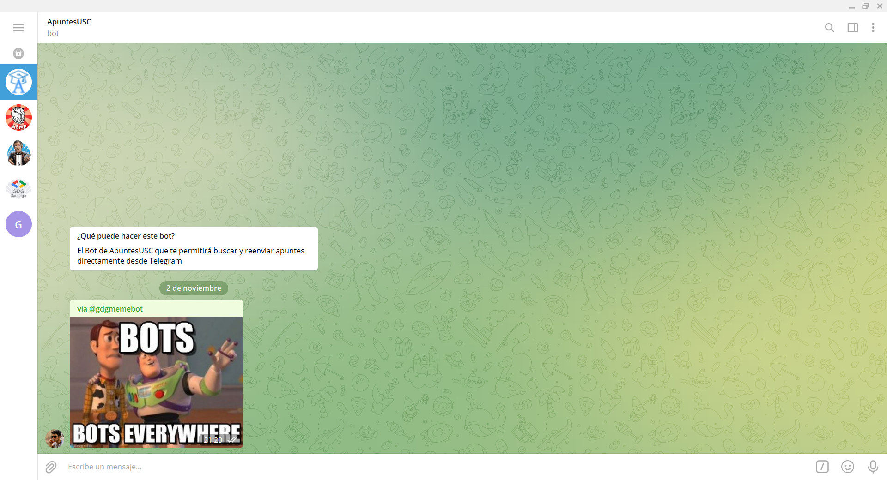

# python-meme-bot
Repositorio para el taller GDG

Cada fichero .py es una versión diferente con más funcionalides que el anterior. A continuación se redactan las tareas necesarias que hay que hacer en el BotFather para que el código funcione.


## 0 base-py. 
No hace nada. Es el código mínimo de un bot.
Para crear el bot y obtener el token tenemos que ir al BotFather en Telegram y utilizar el comando /mybots

```
En BotFather: /newbot > Escribir Nombre del bot > Escribir username del bot 
```
El username del bot tiene que ser único y acabar en "bot".



## 1_hello_world.py. 
Responde con el texto que le pasamos en mayúsculas
## 2_enviar_memes.py. 
Envia un meme como respuesta al comando /meme. 
Para ello primero tenemos que añadir el comando /meme desde nuestro BotFather, bien utilizando 
``` /setcommands ```
o 
``` /mycommands > Edit bot > Edit commands```.


De esta forma la App de Telegram sabrá que comandos tiene nuestro bot y se los mostrará al usuario. 



## 3_enviar_memes_chat_action.py.
Además de enviar el meme, indica al usuario que está enviando una foto.


## 4_teclados.py. 
Envía un botón con el meme para que puedas ver otro sin tener que escribir de nuevo el comando

## 5_InlineQuery.py. 
Implementa la funcionalidad InlineQuery para enviar memes por otros chats en los que no está el bot

Antes de nada, debemos de activar esta funcionalidad desde el BotFather. Como siempre, con el comando ``` /mybots > Bot Settings > Inline mode > Turn inline mode on```. Desde ahí tambien podemos cambiar el texto que sale (en nuestro caso, "Busca un meme") pulsando el botón ``` Edit inline placeholder```

El resultado una vez configurado y en ejecución es el siguiente:




# Fuentes
* [Bot: An introduction for developers](https://core.telegram.org/bots) - Web oficial de Telegram dónde menciona funcionalidades de los bots
* [Documentación oficial](https://python-telegram-bot.readthedocs.io/en/stable/)
* [Github con ejemplos](https://github.com/python-telegram-bot/python-telegram-bot/tree/master/examples)